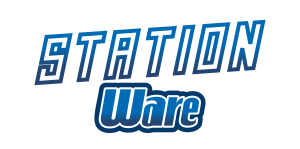

 

StationWare is a fork of SS14 primarily focused on WarioWare-like gameplay and general wackiness.

## Links

[Discord](https://discord.gg/TutAsX6JnY)

## License

All code for the content repository is licensed under [MIT](https://github.com/space-wizards/space-station-14/blob/master/LICENSE.TXT).

Most assets are licensed under [CC-BY-SA 3.0](https://creativecommons.org/licenses/by-sa/3.0/) unless stated otherwise. Assets have their license and the copyright in the metadata file. [Example](https://github.com/space-wizards/space-station-14/blob/master/Resources/Textures/Objects/Tools/crowbar.rsi/meta.json).

Note that some assets are licensed under the non-commercial [CC-BY-NC-SA 3.0](https://creativecommons.org/licenses/by-nc-sa/3.0/) or similar non-commercial licenses and will need to be removed if you wish to use this project commercially.
